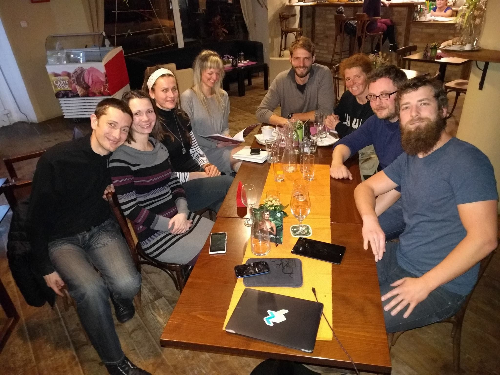


Nejen my jsme Zažít Roudnici Jinak
Hlavní součástí jste vy

Poprvé jsme se potkali v květnu roku 2015 a se společnou myšlenkou na akci, při které jsou si lidé blíž, jsme začali plánovat „*Zažít město jinak*“.

Na jaře 2016 jsme se rozhodli, že bude lepší, když našemu činění dodáme formu. A tak jsme založili zapsaný spolek. Nyní jsme **Zažít Roudnici jinak, z. s.** Zřídili jsme transparentní účet a plni odhodlání proměňujeme naše nápady v realitu.  
A kdo jsme? Jsme parta (duchem) mladých lidí, kteří se zajímají o město, v němž žijí. Každý umíme něco jiného a dohromady tvoříme super tým. Scházíme se často a pracujeme někdy až do noci 🙂 bez nároku na honorář, odměnou jsou nám úsměvy Roudničanů a pocit dobře vykonané práce.

Líbí se vám, co děláme? Podpořte nás!  

Zapojte se vlastními silami, nebo přispějte libovolným příspěvkem na náš účet: **2100994398/2010**

pozn.: Na fotce chybí Gita.