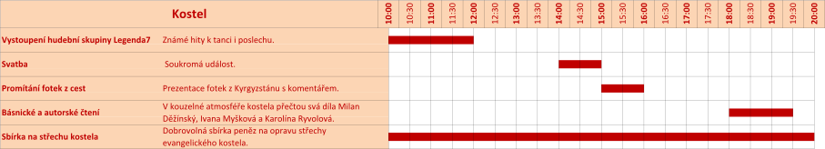

V roce 2015 jsme poprvé uspořádali slavnost Zažít Roudnici jinak. Byl to první velký společný projekt, který nás nakopnul k dalším aktivitám. [Album](https://get.google.com/albumarchive/118040934014524523956/album/AF1QipNpKDbnfJANusUuBxbE6lZnNYOnr6bBrNNuCG5Q).

### O ČEM TO JE?

Sousedské slavnosti Zažít město jinak letos oslaví desáté výročí své existence. Několik bláznivých lidí a patriotů si řeklo, že něco takového v našem městě chybí a že by bylo dobré to uspořádat. Pro Roudnici nad Labem je to tak ročník první.

Hlavním organizátorem Zažít město jinak na celostátní úrovni je sdružení Auto*Mat.

Jsme rádi, že nás podpořilo také město Roudnice nad Labem a pan starosta Vladimír Urban převzal záštitu nad touto akcí.

### Program

Je to sice fráze, ale musíme ji použít: „Změny v programu vyhrazeny.“ Připravili jsme pro Vás celkem sedm zón a níže naleznete harmonogram. Program hudební scény doplníme cobydup.

Všichni účinkující vystupují bez nároku na honorář. Pokud se Vám jejich výkon líbí, řekněte jim to.

Vstup je zdarma a je na vlastní nebezpečí.

#### KAREL

#### ZÁKLADNA

#### PARKOVIŠTĚ

#### GRILZÓNA

#### KOSTEL

#### SPORTZÓNA

#### DVŮR

### Mapa aktivit

### Podpořili nás

**PODPOROVATELI JSOU PŘEDEVŠÍM TI, KTEŘÍ NA AKCI DORAZILI…!**

- Záštitu nad akcí převzal pan starosta Vladimír Urban, děkujeme.
- Město Roudnice nad Labem přispělo na ZRJ 2016 20 000 Kč, děkujeme.
- RETE internet, s.r.o. – sponzoring cestovatelské fotovýstavy, děkujeme.
- Hypoteční banka, Michalská 12 – věcné ceny do výtvarné soutěže, děkujeme.
- Celostátní propagaci a koordinaci má na starosti sdružení Auto*Mat, děkujeme.
- Logo Zažít Roudnici jinak zdarma vytvořil Aleš Doucha, děkujeme.
- Pan Karel Schejbal nám bezplatně poskytl své prostory pro uskladnění materiálu, děkujeme.
- Firma Projekce dopravní Filip, s.r.o. nám zdarma vytvořila DIO na ZRJ 2016, děkujeme.
- EVbike.
- Podřipská realitní.
- Trafika Alena Puršlová.
- Snowpanic.
- Komerční banka, a.s.
