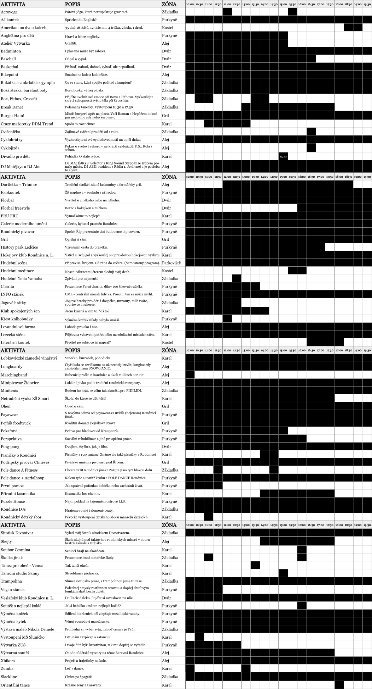
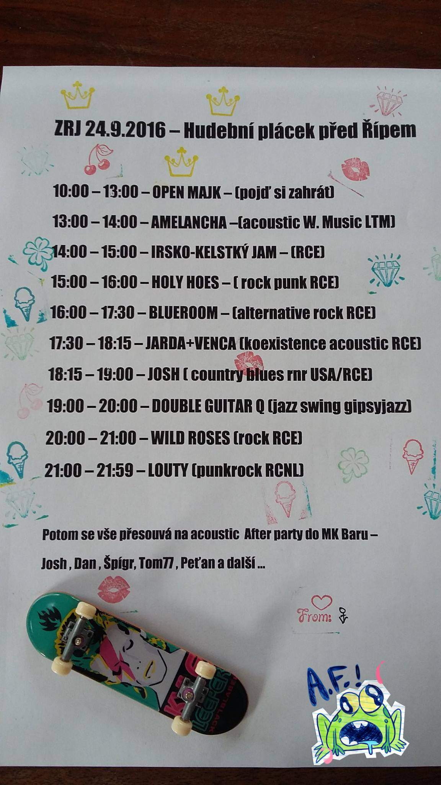
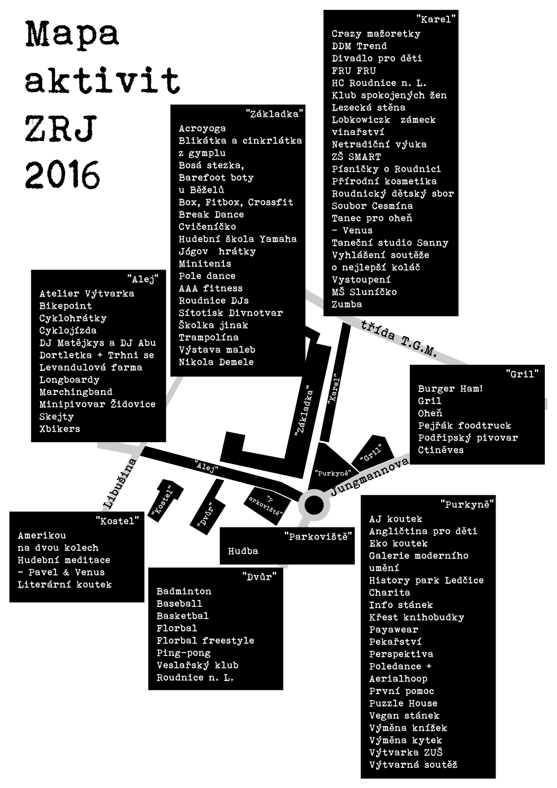

Druhý ročník ZRJ klepe na dveře a my ho do ulic vpustíme v sobotu 24. 9. 2016 od 10 do 20 hodin. 8 zón, 80 aktivit, 10 kapel, 8 DJs. Jakou si tu sobotu uděláme, taková bude. Přines si  deku, karimatku, něco na gril, půllitr, kytku, knížku nebo třeba vyvenči kolo a zúčastni se nejkratší cyklojízdy na světě. Těšíme se na viděnou!

### O akci?

Letos se sousedské slavnosti rozšířili o jednu významnou zónu, o část aleje 17. listopadu.

Přijď zažít Roudnici jinak, bez aut a se sousedy a vyber si z 80 aktivit. Uvidíš, kolik zajímavých lidí v našem městě žije! Začínáme v 10 a konec je plánovaný na 20. hodinu, ale už teď je jasné, že v Café Baru Giraffe nebo v eMKáčku bude zábava dlouho do noci…

### Program

Bude toho hodně, hodně moc… Většina aktivit bude probíhat celý den, některé pak jen v určitý čas.

Je to sice fráze, ale musíme ji použít: „Změny v programu vyhrazeny.“

Všichni účinkující vystupují bez nároku na honorář. Pokud se Vám jejich výkon líbí, řekněte jim to.

Program HUDEBNÍ SCÉNY uveden dole.

Vstup je zdarma a je na vlastní nebezpečí.

### Mapa aktivit

### Podpořili nás

**PODPOROVATELI JSOU PŘEDEVŠÍM TI, KTEŘÍ NA AKCI DORAZILI…!**

- Záštitu nad akcí převzal pan starosta Vladimír Urban, děkujeme.
- Město Roudnice nad Labem přispělo na ZRJ 2016 20 000 Kč, děkujeme.
- RETE internet, s.r.o. – sponzoring cestovatelské fotovýstavy, děkujeme.
- Hypoteční banka, Michalská 12 – věcné ceny do výtvarné soutěže, děkujeme.
- Celostátní propagaci a koordinaci má na starosti sdružení Auto*Mat, děkujeme.
- Logo Zažít Roudnici jinak zdarma vytvořil Aleš Doucha, děkujeme.
- Pan Karel Schejbal nám bezplatně poskytl své prostory pro uskladnění materiálu, děkujeme.
- Firma Projekce dopravní Filip, s.r.o. nám zdarma vytvořila DIO na ZRJ 2016, děkujeme.
- EVbike.
- Podřipská realitní.
- Trafika Alena Puršlová.
- Snowpanic.
- Komerční banka, a.s.

